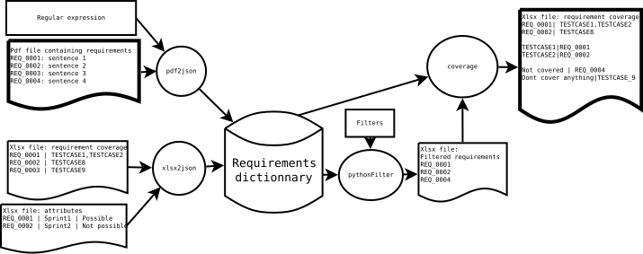

pyReq management of requirements in python language
===================================================

Purpose
-------

EXTRACTION of REQUIREMENTS from PDF DOCUMENTS
See examples after Installation and run demo chapter

Doc
-------

Req are stored in Json file from python

- pdf2json.py extract requirements from pdf to json

- xlsx2json.py allows to write in Json file from xlsx (excel)
  file a list of requirements + attribute and covered requirements

- json2xlsx.py + a list of requirements can get back for this
  list of requirements the covered req and the correspondings attributes

Directories goal 
----------------

- in : input files (pdf), xlsx (input): your input(s)
- out : result of an extraction : dont modify it
- work: permanent requirements storage (like a database) in json format
- scripts: python scripts (see doc in doc file)
- doc: minimalist schema trying to explain how it works

Installation and run demo on Linux Ubuntu 
-----------------------------------------

    - pip install poetry

    - git clone https://github.com/fcabaud/pyReq.git

    - cd pyReq

    - cd scripts

    - poetry shell 

Examples
-------

pyReq.py can be used for :
   1. **Parsing requirements via regexp from pdf files**

    python3 ./pdf2json.py ../in/docExample.pdf "(RQT_[0-9]{4})(.*)" ../work/docExample.json

    will extract requirements of docExample.pdf via a regular expression in docExample.json

   2. **Adding attributes to requirements (TargetMilestone, Maturity)**

     python3 ./xlsx2json.py ../in/reqListSprints.xlsx ../work/docExample.json

     will add attributes of requirements from reqListSprints.xlsx to docExample.json

   3. **Traceability from requirement to others requirements (ex: testcase)**

     python3 ./xlsx2json.py ../in/reqListCoverage.xlsx ../work/docExample.json

     will provides traceability between requirements from reqListCoverage.xlsx to docExample.json

   4. **Sorting requirements**

     python3 ./json2xlsx.py ../work/docExample.json ../out/reqListStatusKO.xlsx

     will extract requirements which have tests failed from docExample.json to reqListStatusKO.xlsx

   5. **Exporting requirements to testlink tool**

     python3 ./json2xlsx.py ../work/docExample.json ../out/testlinkInput.csv

     will export a testlink csv file from docExample.json
  
   5. **Exporting requirements to redmine tool**

     python3 ./json2redmine.py ../work/docExample.json ../out/testRedmine.csv

     will export a redmine csv file from docExample.json

License
-------

This project is licensed under the terms of the MIT license.
